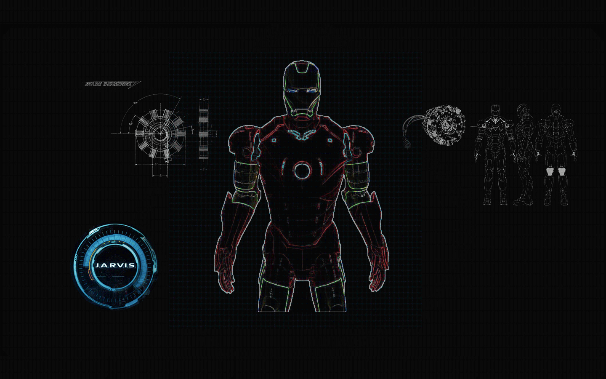

  

  &nbsp;&nbsp;&nbsp;
  &nbsp;&nbsp;&nbsp;
  &nbsp;&nbsp;&nbsp;
  &nbsp;&nbsp;&nbsp;
  

<!-- Uncomment after adding .github/workflows/metrics.yml (see WORKFLOWS.md) and letting it run once.
 

-->

- 🔭 Building full stack apps with **Java, Spring Boot &amp; Angular**
- ☁️ Deploying and automating on **AWS &amp; Docker**
- 🌱 Currently sharpening **microservices** and **system design**
- 💬 Ask me about Spring Boot, REST APIs, Hibernate or SQL
- 📫 Reach me at **thejakusini@gmail.com**

 

<b>Languages:</b>&nbsp;&nbsp;&nbsp;
    &nbsp;&nbsp;
    &nbsp;&nbsp;
    &nbsp;&nbsp;
    &nbsp;&nbsp;
    &nbsp;&nbsp;
    &nbsp;&nbsp;
       
<b>Libraries &amp; Frameworks:</b>&nbsp;&nbsp;&nbsp;
    &nbsp;&nbsp;
    &nbsp;&nbsp;
    &nbsp;&nbsp;
    &nbsp;&nbsp;
    &nbsp;&nbsp;
    &nbsp;&nbsp;
       
    <b>Tools &amp; Platforms:</b>&nbsp;&nbsp;&nbsp;
    &nbsp;&nbsp;
    &nbsp;&nbsp;
    &nbsp;&nbsp;
    &nbsp;&nbsp;
    &nbsp;&nbsp;
    &nbsp;&nbsp;
    &nbsp;&nbsp;
    &nbsp;&nbsp;
    &nbsp;&nbsp;
    &nbsp;&nbsp;
       
    <b>Databases:</b>&nbsp;&nbsp;&nbsp;
    &nbsp;&nbsp;
    &nbsp;&nbsp;
    

    

    
    

    
    

    

    <!-- Uncomment after adding .github/workflows/snake.yml and 3d-contrib.yml (see WORKFLOWS.md) and letting them run once.
     
    
    -->

  

  

    
  

  

    
  

  

  <!-- Drop the image files into assets/ and swap these badges for "> -->
  
  
  

<!-- Enable once you rank on committers.top:
 

-->

  

